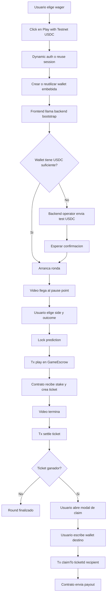

# Predict & Take
## PRD Tecnico: Smart Contracts + Backend Minimo

### Objetivo
Definir la arquitectura minima shippable para llevar el juego a una logica on-chain usando:

- `Dynamic` como proveedor obligatorio de wallets
- `Arc Testnet` como chain
- `USDC` como activo del juego
- `1` solo contrato on-chain
- un backend minimo sin dependencia obligatoria de base de datos

---

## 1. Resumen Ejecutivo

La version minima del sistema funciona asi:

1. El usuario elige un monto y toca `Play with Testnet USDC`.
2. Si no existe, se crea su wallet embebida con `Dynamic`.
3. El backend fondea esa wallet con `testnet USDC` usando una wallet operadora.
4. El usuario mira el clip y, cuando se cierra la prediccion, firma la transaccion que bloquea el stake en el contrato.
5. El contrato escrow registra la apuesta y luego la liquida.
6. Si el usuario gana, puede hacer `claim` a cualquier wallet destino que escriba manualmente.

La wallet usada para jugar puede ser descartable. El cobro final puede hacerse a otra wallet.

---

## 2. Objetivos del Producto

### Objetivos

- reducir al minimo la friccion para jugar
- crear la wallet solo cuando el usuario toca `Play`
- mover fondos al contrato solo cuando la prediccion queda lockeada
- permitir claim a una wallet arbitraria
- usar un modelo on-chain simple, auditable y facil de implementar

### No objetivos para esta version

- commit/reveal
- privacidad de picks
- matching entre jugadores
- prediction market con orderbook o AMM
- oraculos
- abstraccion avanzada de AA como requisito para que el MVP funcione
- base de datos obligatoria

---

## 3. Stack y Decisiones Obligatorias

### Frontend

- `Dynamic JavaScript SDK`
- wallet embebida EVM
- cliente EVM para firmar transacciones del jugador

### Backend minimo

- `Dynamic Node SDK`
- wallet operadora controlada por servidor
- endpoints minimos para bootstrap y funding

### Blockchain

- `Arc Testnet`
- `USDC` como token del juego y gas de red

### On-chain

- `1` solo contrato llamado provisionalmente `GameEscrow`

---

## 4. Principios de Diseno

### 4.1 Wallet invisible al inicio

No se muestra un paso de connect wallet previo. La wallet se crea o reutiliza cuando el usuario toca `Play`.

### 4.2 Stake solo al lock

Aunque el CTA diga `Play with Testnet USDC`, el dinero no entra al contrato al inicio del flow. El stake se deposita on-chain solo cuando la prediccion queda confirmada.

### 4.3 Wallet de juego separada de wallet de retiro

La wallet embebida se usa para jugar y firmar. El retiro puede enviarse a cualquier address EVM que el usuario ingrese manualmente.

### 4.4 Un solo contrato

Toda la logica del juego vive en un unico contrato:

- custodiar bankroll
- recibir stakes
- registrar picks
- liquidar tickets
- pagar claims

### 4.5 Backend minimo, no inexistente

No hace falta una base de datos para el MVP, pero si hace falta un servicio backend para:

- autenticar al usuario de la app
- gatillar el funding inicial
- controlar la wallet operadora
- exponer endpoints de bootstrap

---

## 5. Arquitectura General

### Componentes

#### Frontend app

- UI del juego
- autenticacion y wallet embebida con Dynamic
- lectura del estado del contrato
- firma de transacciones del jugador

#### Backend minimo

- valida sesion
- consulta balances
- ejecuta el faucet simple
- usa la wallet operadora para enviar USDC de prueba

#### Contrato `GameEscrow`

- mantiene el bankroll del juego
- recibe la apuesta al lockear prediccion
- guarda el ticket
- liquida el ticket
- habilita claim a wallet arbitraria

---

## 6. Tipos de Wallets

### Wallet del jugador

- embebida
- creada con Dynamic
- usada para firmar la apuesta y el claim
- puede ser descartable

### Wallet operadora

- server wallet controlada por backend
- fondea bankroll del contrato
- manda test USDC a jugadores para arrancar

### Wallet destino de claim

- cualquier wallet EVM valida
- no necesita estar vinculada a Dynamic
- la define manualmente el usuario al cobrar

---

## 7. Flujo End-to-End

### Flujo principal

1. Usuario selecciona `1`, `10` o `25` USDC.
2. Toca `Play with Testnet USDC`.
3. Frontend inicia auth con Dynamic.
4. Si falta, se crea la wallet embebida EVM.
5. Frontend llama al backend para bootstrap del juego.
6. Backend verifica si la wallet del usuario tiene balance suficiente.
7. Si no tiene, la wallet operadora envia test USDC.
8. Cuando el funding esta listo, el juego sigue.
9. El video llega al pause point.
10. Usuario elige direccion y outcome.
11. Al lockear la prediccion, el frontend firma la tx `play(...)`.
12. El contrato mueve el stake del jugador al escrow y crea el ticket.
13. El video termina.
14. Frontend o backend llama `settle(ticketId)`.
15. Si el ticket gana, queda saldo claimable.
16. Usuario abre modal de claim.
17. Escribe una wallet destino.
18. Firma `claimTo(ticketId, recipient)`.
19. El contrato envia el USDC a esa wallet.

---

## 8. Diagrama de Flujo

---

## 9. Contrato Unico: `GameEscrow`

### Responsabilidades

- custodiar el bankroll del juego
- custodiar el stake de las rondas activas
- almacenar configuracion y resultados por clip
- crear tickets
- liquidar tickets
- permitir claims
- cobrar fee si aplica

### Responsabilidades que explicitamente no toma en esta version

- ocultar resultados
- verificar resultados por oracle
- resolver disputas
- hacer matching entre usuarios

---

## 10. Modelo de Datos On-Chain

### `ClipConfig`

Configuracion minima por clip:

- `enabled`
- `resultDirection`
- `resultOutcome`

En esta version el resultado puede quedar on-chain en claro.

### `Ticket`

Campos minimos:

- `player`
- `clipId`
- `amount`
- `direction`
- `outcome`
- `status`
- `payout`
- `claimed`

### Estados de ticket

- `None`
- `Active`
- `Settled`
- `Claimed`

---

## 11. API del Contrato

### Funciones admin/operator

- `fundBankroll(uint256 amount)`
- `withdrawBankroll(uint256 amount, address to)`
- `setClip(uint256 clipId, bool enabled, uint8 resultDirection, uint8 resultOutcome)`
- `setHouseFeeBps(uint16 bps)`
- `pause()`
- `unpause()`

### Funciones de usuario

- `play(uint256 clipId, uint256 amount, uint8 direction, uint8 outcome)`
- `settle(uint256 ticketId)`
- `claimTo(uint256 ticketId, address recipient)`

### Views

- `quotePayout(uint256 amount, uint8 direction, uint8 outcome, uint256 clipId)`
- `getTicket(uint256 ticketId)`
- `getClip(uint256 clipId)`
- `canClaim(uint256 ticketId)`

---

## 12. Reglas de Negocio On-Chain

### 12.1 Wagers soportados

Para MVP:

- `1 USDC`
- `10 USDC`
- `25 USDC`

### 12.2 Solo clips habilitados

`play()` debe revertir si el clip no existe o no esta habilitado.

### 12.3 Solvencia antes de aceptar apuesta

Antes de aceptar el ticket, el contrato debe verificar que puede cubrir el payout maximo correspondiente.

### 12.4 Claim separado del settle

`settle()` no envia el dinero automaticamente. Solo deja el payout como claimable.  
`claimTo()` envia el dinero a la wallet destino.

Esto simplifica la UX de wallet burneable.

### 12.5 Solo el owner del ticket puede cobrar

El owner del ticket puede enviar el claim a cualquier `recipient`, pero nadie mas puede iniciar ese claim.

### 12.6 Claim unico

Cada ticket se puede cobrar una sola vez.

---

## 13. Modelo de Payout

Se recomienda conservar el modelo conceptual ya usado en frontend:

- mitad del wager para `direction`
- mitad del wager para `outcome`
- payout segun pricing fijo
- fee de la casa opcional

### Recomendacion tecnica

No usar floats on-chain.  
Guardar precios como enteros escalados, por ejemplo en `1e6`.

Ejemplo:

- `left = 380000`
- `right = 620000`
- `goal = 780000`
- `miss = 220000`

### Formula conceptual

- `directionBet = amount / 2`
- `outcomeBet = amount / 2`
- si acierta direction: `directionGross = directionBet / directionPrice`
- si acierta outcome: `outcomeGross = outcomeBet / outcomePrice`
- `gross = directionGross + outcomeGross`
- `fee = gross * houseFeeBps / 10000`
- `net = gross - fee`

---

## 14. Funding Inicial Tipo Faucet

### Decision

No se usa un faucet on-chain.  
Se usa el camino mas simple para shipping:

- una wallet operadora del backend envia test USDC a la wallet del jugador

### Ventajas

- menos contratos
- menos superficie de abuso on-chain
- menos trabajo de implementacion
- mejor control operativo

### Regla operativa sugerida

Enviar al usuario:

- `wager seleccionado`
- mas un `gas buffer`

No enviar mas de lo necesario para una ronda.

---

## 15. Backend Minimo

### Objetivo del backend

Ser una capa operativa muy fina, no un sistema completo de producto.

### Responsabilidades

- validar la sesion del usuario
- descubrir la wallet embebida activa
- verificar balance
- fondear si es necesario
- opcionalmente monitorear eventos

### Endpoints minimos

#### `POST /api/game/bootstrap`

Input:

- `desiredWager`
- `playerWalletAddress`

Output:

- `ready`
- `fundingStarted`
- `topUpTxHash`
- `recommendedClipId`

#### `POST /api/game/fund`

Input:

- `playerWalletAddress`
- `desiredWager`

Output:

- `txHash`
- `fundedAmount`

### Nota

Para MVP, ambos endpoints podrian colapsar en uno solo.

---

## 16. Hace Falta Base de Datos?

### Respuesta corta

No, no es obligatoria para la primera version.

### Por que puede funcionar sin DB

- la identidad vive en Dynamic
- los tickets viven on-chain
- el contrato es source of truth del juego
- el faucet puede operar en forma directa

### Limitaciones de no tener DB

- peor rate limiting
- peor idempotencia
- menos trazabilidad de funding
- menos analytics

### Recomendacion

No bloquear el MVP por falta de DB.  
Si luego se agrega una, lo primero seria usarla para:

- rate limiting del faucet
- registro de funding attempts
- observabilidad

---

## 17. Dynamic: Uso Recomendado

### Frontend con Dynamic JS SDK

Se usa para:

- autenticar al usuario
- crear o reutilizar la wallet embebida
- firmar las txs `play()` y `claimTo()`

### Backend con Dynamic Node SDK

Se usa para:

- manejar la wallet operadora
- firmar y enviar los top-ups en testnet

### Decision importante

Aunque `Arc` hable de Account Abstraction y paymasters, esta version no debe depender de una integracion AA sofisticada para poder salir.  
Dynamic sigue siendo obligatorio, pero el criterio de diseño del MVP es:

- primero que el flujo funcione bien
- despues, si conviene, se agrega sponsorship o AA mas profunda

---

## 18. Consideraciones de Arc y USDC

### Red

- `Arc Testnet`
- RPC: `https://rpc.testnet.arc.network`
- Chain ID: `5042002`

### Token

USDC en Arc tiene una particularidad:

- el gas nativo de red usa precision de `18`
- la interfaz ERC-20 de USDC usa `6`

### Recomendacion

Para la logica del juego y del contrato, trabajar siempre con la interfaz ERC-20 de USDC.

USDC address en Arc Testnet:

- `0x3600000000000000000000000000000000000000`

---

## 19. Riesgos Conocidos

### 19.1 Resultado visible on-chain

En esta version no se protege el resultado del clip.

### 19.2 Faucet abusado

Sin DB ni rate limiting fuerte, el top-up es mas facil de abusar.  
Aceptable para testnet y hackathon.

### 19.3 Falta de bankroll

Si el contrato no tiene solvencia suficiente, `play()` debe revertir.

### 19.4 Wallet descartable

Si el usuario pierde acceso a la wallet embebida antes del claim, no puede retirar.  
Eso es coherente con el modelo burneable y por eso el claim debe hacerse pronto.

---

## 20. Checklist de Implementacion

### Fase 1

- integrar Dynamic en frontend
- crear wallet embebida al tocar `Play`
- obtener address y balance

### Fase 2

- crear backend minimo
- crear wallet operadora con Dynamic Node SDK
- implementar funding simple

### Fase 3

- implementar contrato `GameEscrow`
- agregar funding de bankroll
- cargar clips y resultados

### Fase 4

- conectar `play()` al lock de prediccion
- conectar `settle()` al final del clip
- construir modal `claimTo()`

### Fase 5

- testear casos de error
- testear bankroll insuficiente
- testear doble claim
- testear claim a wallet arbitraria

---

## 21. Definicion Final del MVP

La definicion final de la V1 es:

- el usuario toca `Play with Testnet USDC`
- Dynamic crea o reutiliza su wallet embebida
- el backend la fondea con test USDC
- el usuario juega
- al lockear la prediccion, el stake entra al contrato
- el contrato liquida la ronda
- el usuario hace claim a cualquier wallet que elija

Esto cumple con:

- `Dynamic` como proveedor obligatorio
- `1` solo contrato
- faucet simple para shipping
- wallet burneable
- claim externo
- backend minimo sin DB obligatoria

---

## 22. Referencias

- Arc Account Abstraction: <https://docs.arc.network/arc/tools/account-abstraction>
- Arc Connect: <https://docs.arc.network/arc/references/connect-to-arc.md>
- Arc Gas and Fees: <https://docs.arc.network/arc/references/gas-and-fees.md>
- Arc Contract Addresses: <https://docs.arc.network/arc/references/contract-addresses.md>
- Arc EVM Compatibility: <https://docs.arc.network/arc/references/evm-compatibility.md>
- Dynamic docs index: <https://www.dynamic.xyz/docs/llms.txt>
- Dynamic Server Wallets: <https://www.dynamic.xyz/docs/node/wallets/server-wallets/overview>
- Dynamic Creating WaaS Wallet Accounts: <https://www.dynamic.xyz/docs/javascript/reference/waas/creating-waas-wallet-accounts>
- Dynamic Viem Wallet Client: <https://www.dynamic.xyz/docs/javascript/reference/evm/getting-viem-wallet-client>
- Dynamic EVM Extensions: <https://www.dynamic.xyz/docs/javascript/reference/evm/adding-evm-extensions>
