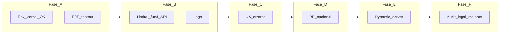

# Próximos pasos hasta el resultado final

Este documento ordena el trabajo **después** de tener código mergeado y una primera URL en Vercel. La configuración paso a paso (envs, contratos, wallets) está en [GUIA_CONFIGURACION_OPERATIVA.md](./GUIA_CONFIGURACION_OPERATIVA.md). El alcance funcional del MVP está en [Onchain_SmartContracts_Backend_PRD.md](./Onchain_SmartContracts_Backend_PRD.md).

---

## Definición de “resultado final”

### MVP en testnet (objetivo cercano)

Un jugador puede, en la **URL de producción** (Vercel) sobre **Arc Testnet**:

1. Obtener o reutilizar una wallet con **Dynamic**.
2. Recibir **USDC de testnet** vía el backend (faucet operado).
3. Bloquear la apuesta on-chain (`play`) al confirmar la predicción.
4. Ver el clip; al terminar, el sistema **liquida** el ticket (`settle` vía servidor).
5. Si corresponde, **cobrar** a la wallet conectada o a una dirección escrita (`claimTo`).

El contrato y el bankroll están **configurados** para los clips de demo y los montos $1 / $10 / $25, sin errores frecuentes de solvencia ni de red.

Eso es el **“final” razonable para hackathon / beta en testnet** descrito en el PRD.

### Más allá del MVP (no es requisito del “final” testnet)

- Red **mainnet** o activos con valor real.
- **Auditoría** de contratos y proceso legal (términos, KYC si aplica).
- **Antiabuso fuerte** del faucet y modelo económico de fees/bankroll a escala.
- **Base de datos** y producto analítico completo.

---

## Fase A — Estabilizar el MVP testnet en “producción”

**Objetivo:** una URL estable que el equipo puede demostrar sin sorpresas.

- [ ] Completar la [guía operativa](./GUIA_CONFIGURACION_OPERATIVA.md) en el entorno **Production** de Vercel.
- [ ] Hacer una **corrida end-to-end** grabada o checklist (Play → fund → lock → vídeo → settle → claim).
- [ ] Separar **Preview** vs **Production** en Vercel (contratos distintos o mismos, pero variables claras).
- [ ] Documentar en un sitio interno: dirección del escrow, USDC, owner, operadora (solo direcciones públicas), enlace al explorador.

---

## Fase B — Operación y abuso

**Objetivo:** reducir costo y abuso del faucet público sin reescribir el producto.

- [ ] **Rate limiting** o tope por IP / por dirección en `POST /api/game/fund` (hoy es público).
- [ ] **Idempotencia** básica (evitar doble fund en doble click o reintentos).
- [ ] Revisar **logs** en Vercel en cada error de usuario; opcional: alertas si fallan muchos `fund` o `settle`.
- [ ] Política explícita: “testnet solo”, sin promesas de valor real.

---

## Fase C — Producto y UX

**Objetivo:** que un usuario no técnico entienda qué pasa cuando algo falla.

- [ ] Sustituir `alert()` por mensajes en UI donde hoy el flujo on-chain falla (funding, tx rechazada, settle).
- [ ] Estados de carga claros en Play y en el modal de wallet.
- [ ] Texto corto de ayuda (FAQ o tooltip): red Arc testnet, que es USDC de prueba, que el claim es on-chain.
- [ ] Revisar copy en pantalla de resultado (ganador / perdedor / sin claim).

---

## Fase D — Datos opcionales

**Objetivo:** trazabilidad cuando el PRD pase de “sin DB obligatoria” a operación seria.

- [ ] Tabla o servicio para **intentos de funding** (quién, cuánto, éxito/fallo).
- [ ] Métricas mínimas: partidas iniciadas, `play` exitosos, `claim` completados.
- [ ] Si hay fraude: bloqueo de direcciones o límites diarios desde datos reales.

---

## Fase E — Dynamic y servidor avanzado

**Objetivo:** alinear con la visión “wallet operadora” del PRD usando más Dynamic en servidor.

- [ ] Evaluar **server wallets** / API de Dynamic para no guardar una clave EVM cruda en Vercel (o combinar ambos).
- [ ] Extender el uso de `DYNAMIC_API_KEY` y el cliente en [src/lib/dynamicSdk.ts](../src/lib/dynamicSdk.ts) según la documentación vigente de Dynamic.
- [ ] Mantener un camino de **rollback** (viem + clave) para entornos de demo rápidos.

---

## Fase F — Pre-mainnet (solo si el producto lo exige)

**Objetivo:** no mover valor real sin checklist de riesgo.

- [ ] **Auditoría** o revisión externa del `GameEscrow` y de las integraciones.
- [ ] **Multisig** o custodia para owner del contrato y para tesorería.
- [ ] **Términos legales** y límites de jurisdicción.
- [ ] Elegir red (L2, mainnet, etc.) y repetir despliegue + guía operativa en ese entorno.

---

## Resumen visual

Las fases D, E y F son **opcionales** hasta que el negocio lo pida; A + B + C suelen ser el núcleo para un “final” sólido en testnet.
