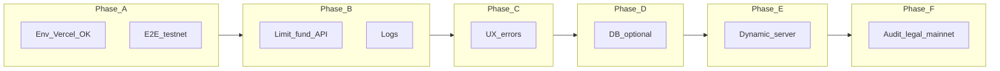

# Next steps to the final outcome

This document organizes the work **after** code has been merged and you have a first URL on Vercel. The step-by-step configuration (env vars, contracts, wallets) is in [operational-setup-guide.md](./operational-setup-guide.md). The MVP functional scope is in [onchain-smart-contracts-backend-prd.md](./onchain-smart-contracts-backend-prd.md).

---

## Definition of “final outcome”

### MVP on testnet (near-term target)

A player can, on the **production URL** (Vercel) on **Arc Testnet**:

1. Get or reuse a wallet via **Dynamic**.
2. Receive **testnet USDC** via the backend (operated faucet).
3. Lock the stake on-chain (`play`) when confirming the prediction.
4. Watch the clip; at the end, the system **settles** the ticket (`settle` via server).
5. If applicable, **claim** to the connected wallet or to a manually entered address (`claimTo`).

The contract and bankroll are **configured** for the demo clips and the $1 / $10 / $25 amounts, without frequent solvency or network errors.

That’s the **reasonable “final” for a hackathon / testnet beta** described in the PRD.

### Beyond the MVP (not required for the testnet “final”)

- **Mainnet** or real-value assets.
- Contract **audit** and legal process (terms, KYC if applicable).
- Stronger faucet abuse prevention and a scalable fees/bankroll economic model.
- A **database** and full analytics product.

---

## Phase A — Stabilize the testnet MVP in “production”

**Goal:** a stable URL the team can demo without surprises.

- [ ] Complete the [operational guide](./operational-setup-guide.md) in the **Production** Vercel environment.
- [ ] Do a recorded **end-to-end run** or checklist (Play → fund → lock → video → settle → claim).
- [ ] Separate **Preview** vs **Production** in Vercel (different contracts or the same ones, but clear variables).
- [ ] Document internally: escrow address, USDC address, owner, operator (public addresses only), and explorer link.

---

## Phase B — Operations and abuse

**Goal:** reduce cost and abuse of the public faucet without rewriting the product.

- [ ] **Rate limiting** or caps per IP / per address in `POST /api/game/fund` (currently public).
- [ ] Basic **idempotency** (avoid double fund on double click or retries).
- [ ] Review **logs** in Vercel for each user error; optional: alerts if many `fund` or `settle` calls fail.
- [ ] Explicit policy: “testnet only”, no promises of real value.

---

## Phase C — Product and UX

**Goal:** a non-technical user understands what happens when something fails.

- [ ] Replace `alert()` with UI messages where the on-chain flow fails today (funding, rejected tx, settle).
- [ ] Clear loading states on Play and in the wallet modal.
- [ ] Short help text (FAQ or tooltip): Arc testnet, test USDC, claim is on-chain.
- [ ] Review copy on the result screen (winner / loser / no claim).

---

## Phase D — Optional data

**Goal:** traceability when the PRD moves from “no DB required” to serious operations.

- [ ] Table or service for **funding attempts** (who, how much, success/failure).
- [ ] Minimal metrics: rounds started, successful `play`, completed `claim`.
- [ ] If there’s fraud: address blocks or daily limits based on real data.

---

## Phase E — Dynamic and advanced server

**Goal:** align with the PRD’s “operator wallet” vision using more Dynamic on the server.

- [ ] Evaluate **server wallets** / Dynamic APIs to avoid storing a raw EVM private key in Vercel (or combine approaches).
- [ ] Extend `DYNAMIC_API_KEY` usage and the client in [src/lib/dynamicSdk.ts](../src/lib/dynamicSdk.ts) per Dynamic’s current docs.
- [ ] Keep a **rollback** path (viem + key) for fast demo environments.

---

## Phase F — Pre-mainnet (only if the product requires it)

**Goal:** don’t move real value without a risk checklist.

- [ ] **Audit** or external review of `GameEscrow` and integrations.
- [ ] **Multisig** or custody for the contract owner and treasury.
- [ ] **Legal terms** and jurisdiction limits.
- [ ] Choose a network (L2, mainnet, etc.) and repeat deployment + operational guide for that environment.

---

## Visual summary

Phases D, E, and F are **optional** until the business requires them; A + B + C are usually the core for a solid testnet “final”.
