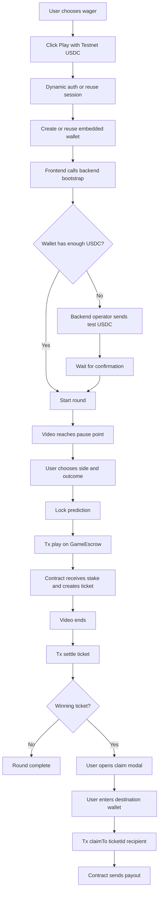

# Predict & Take
## Technical PRD: Smart Contracts + Minimal Backend

### Goal
Define the minimum shippable architecture to move the game to an on-chain flow using:

- `Dynamic` as the required wallet provider
- `Arc Testnet` as the chain
- `USDC` as the game asset
- exactly `1` on-chain contract
- a minimal backend with no required database dependency

---

## 1. Executive summary

The minimum version of the system works like this:

1. The user chooses an amount and taps `Play with Testnet USDC`.
2. If needed, an embedded wallet is created via `Dynamic`.
3. The backend funds that wallet with testnet USDC using an operator wallet.
4. The user watches the clip and, when the prediction closes, signs the transaction that locks the stake in the contract.
5. The escrow contract records the bet and later settles it.
6. If the user wins, they can `claim` to any destination wallet they manually enter.

The wallet used to play can be disposable. The final payout can be sent to a different wallet.

---

## 2. Product goals

### Goals

- minimize friction to play
- create the wallet only when the user taps `Play`
- move funds into the contract only when the prediction is locked
- allow claiming to an arbitrary wallet
- use a simple, auditable, easy-to-implement on-chain model

### Non-goals for this version

- commit/reveal
- privacidad de picks
- matching entre jugadores
- prediction market con orderbook o AMM
- oracles
- advanced AA abstraction as a requirement for the MVP
- a mandatory database

---

## 3. Stack and required decisions

### Frontend

- `Dynamic JavaScript SDK`
- embedded EVM wallet
- EVM client to sign player transactions

### Minimal backend

- `Dynamic Node SDK`
- server-controlled operator wallet
- minimal endpoints for bootstrap and funding

### Blockchain

- `Arc Testnet`
- `USDC` as the game token (network gas is paid with Arc’s native asset)

### On-chain

- exactly `1` contract, provisionally named `GameEscrow`

---

## 4. Design principles

### 4.1 Wallet is invisible at the start

There is no “connect wallet” step upfront. The wallet is created or reused when the user taps `Play`.

### 4.2 Stake only at lock

Even if the CTA says `Play with Testnet USDC`, funds do not enter the contract at the start of the flow. The stake is deposited on-chain only when the prediction is confirmed (locked).

### 4.3 Separate play wallet vs withdrawal wallet

The embedded wallet is used to play and sign transactions. Withdrawal can be sent to any EVM address the user manually enters.

### 4.4 Single-contract design

All game logic lives in a single contract:

- custody bankroll
- receive stakes
- record picks
- settle tickets
- pay claims

### 4.5 Minimal backend, not “no backend”

The MVP does not require a database, but it does require a backend service to:

- authenticate the app user
- trigger initial funding
- control the operator wallet
- expose bootstrap endpoints

---

## 5. System architecture

### Components

#### Frontend app

- game UI
- authentication + embedded wallet via Dynamic
- reading on-chain contract state
- signing player transactions

#### Minimal backend

- validates the session
- checks balances
- runs the simple faucet flow
- uses the operator wallet to send testnet USDC

#### `GameEscrow` contract

- holds the game bankroll
- receives the stake when the prediction is locked
- stores the ticket
- settles the ticket
- enables claiming to an arbitrary wallet

---

## 6. Wallet types

### Player wallet

- embedded
- created via Dynamic
- used to sign `play()` and `claimTo()`
- can be disposable

### Operator wallet

- server-controlled wallet used by the backend
- funds the contract bankroll
- sends testnet USDC to players to get started

### Claim destination wallet

- any valid EVM wallet address
- does not need to be linked to Dynamic
- chosen manually by the user when claiming

---

## 7. Flujo End-to-End

### Flujo principal

1. The user selects `1`, `10`, or `25` USDC.
2. They tap `Play with Testnet USDC`.
3. The frontend starts Dynamic auth.
4. If needed, an embedded EVM wallet is created.
5. The frontend calls the backend to bootstrap the game.
6. The backend checks whether the player wallet has enough USDC.
7. If it doesn’t, the operator wallet sends testnet USDC.
8. Once funding is ready, the game continues.
9. The video reaches the pause point.
10. The user chooses side and outcome.
11. When the prediction locks, the frontend signs the `play(...)` transaction.
12. The contract transfers the stake into escrow and creates the ticket.
13. The video ends.
14. Frontend or backend calls `settle(ticketId)`.
15. If the ticket wins, it becomes claimable.
16. The user opens the claim modal.
17. The user enters a destination wallet.
18. The user signs `claimTo(ticketId, recipient)`.
19. The contract sends USDC to that wallet.

---

## 8. Flow diagram (end-to-end)



---

## 9. Single contract: `GameEscrow`

### Responsibilities

- custody the game bankroll
- custody the stake for active rounds
- store per-clip configuration and results
- create tickets
- settle tickets
- enable claims
- collect fees (if configured)

### Ticket lifecycle (smart-contract flow)

```mermaid
flowchart TD
  player["Player (msg.sender)"] -->|play(clipId,amount,direction,outcome)| playFn[play]
  playFn --> active["TicketStatus.Active"]

  owner["Owner (GameEscrow.owner)"] -->|settle(ticketId)| settleFn[settle]
  active --> settleFn
  settleFn --> settled["TicketStatus.Settled"]

  settled -->|"payout==0 (losing ticket)"| noClaim[NoClaimPossible]
  settled -->|"payout>0"| canClaim[ClaimablePayout]

  player -->|claimTo(ticketId,recipient)| claimFn[claimTo]
  canClaim --> claimFn
  claimFn --> claimed["TicketStatus.Claimed"]

  claimed --> transfer["USDC transfer(recipient,payout)"]
```

### Explicit non-responsibilities in this version

- hide results
- verify results via oracle
- resolve disputes
- match users

---

## 10. On-chain data model

### `ClipConfig`

Minimal per-clip configuration:

- `enabled`
- `resultDirection`
- `resultOutcome`

In this version the result may be stored on-chain in plaintext.

### `Ticket`

Minimal fields:

- `player`
- `clipId`
- `amount`
- `direction`
- `outcome`
- `status`
- `payout`
- `claimed`

### Ticket states

- `None`
- `Active`
- `Settled`
- `Claimed`

---

## 11. Contract API

### Admin/operator functions

- `fundBankroll(uint256 amount)`
- `withdrawBankroll(uint256 amount, address to)`
- `setClip(uint256 clipId, bool enabled, uint8 resultDirection, uint8 resultOutcome)`
- `setHouseFeeBps(uint16 bps)`
- `pause()`
- `unpause()`

### User functions

- `play(uint256 clipId, uint256 amount, uint8 direction, uint8 outcome)`
- `settle(uint256 ticketId)` (owner-only)
- `claimTo(uint256 ticketId, address recipient)`

### Views

- `quotePayout(uint256 amount, uint8 direction, uint8 outcome, uint256 clipId)`
- `getTicket(uint256 ticketId)`
- `getClip(uint256 clipId)`
- `canClaim(uint256 ticketId)`

---

## 12. On-chain business rules

### 12.1 Supported wagers

For the MVP:

- `1 USDC`
- `10 USDC`
- `25 USDC`

### 12.2 Only enabled clips

`play()` must revert if the clip does not exist or is not enabled.

### 12.3 Solvency before accepting a wager

Before creating the ticket, the contract must verify it can cover the corresponding maximum payout.

### 12.4 Claim separated from settlement

`settle()` does not automatically send funds. It only marks the payout as claimable.  
`claimTo()` sends the funds to the destination wallet.

This simplifies UX when the play wallet is disposable.

### 12.5 Only the ticket owner can claim

The ticket owner can claim to any `recipient`, but no one else can initiate the claim.

### 12.6 Single claim

Each ticket can be claimed only once.

---

## 13. Payout model

We recommend keeping the same conceptual model already used in the frontend:

- half of the wager for `direction`
- half of the wager for `outcome`
- payout based on fixed pricing
- optional house fee

### Technical recommendation

Do not use floats on-chain.  
Store prices as scaled integers, for example at `1e6`.

Example:

- `left = 380000`
- `right = 620000`
- `goal = 780000`
- `miss = 220000`

### Conceptual formula

- `directionBet = amount / 2`
- `outcomeBet = amount / 2`
- if direction is correct: `directionGross = directionBet / directionPrice`
- if outcome is correct: `outcomeGross = outcomeBet / outcomePrice`
- `gross = directionGross + outcomeGross`
- `fee = gross * houseFeeBps / 10000`
- `net = gross - fee`

---

## 14. Initial funding (faucet-style)

### Decision

We do not use an on-chain faucet.  
We take the simplest shippable path:

- a backend operator wallet sends testnet USDC to the player’s wallet

### Advantages

- fewer contracts
- less on-chain abuse surface
- less implementation work
- better operational control

### Suggested operational rule

Send the user:

- the `selected wager`
- plus a `gas buffer`

Do not send more than needed for a single round.

---

## 15. Minimal backend

### Backend goal

Be a very thin operational layer, not a full product system.

### Responsibilities

- validate the user session
- discover the active embedded wallet
- check balances
- fund if needed
- optionally monitor events

### Minimal endpoints

#### `POST /api/game/bootstrap`

Input:

- `desiredWager`
- `playerWalletAddress`

Output:

- `ready`
- `fundingStarted`
- `topUpTxHash`
- `recommendedClipId`

#### `POST /api/game/fund`

Input:

- `playerWalletAddress`
- `desiredWager`

Output:

- `txHash`
- `fundedAmount`

### Nota

For the MVP, both endpoints could be collapsed into a single one.

---

## 16. Do we need a database?

### Short answer

No—it's not required for the first version.

### Why it can work without a DB

- identity lives in Dynamic
- tickets live on-chain
- the contract is the source of truth for the game
- the faucet can operate directly

### Limitations of not having a DB

- weaker rate limiting
- weaker idempotency
- less funding traceability
- fewer analytics

### Recommendation

Don’t block the MVP due to the lack of a DB.  
If you add one later, the first uses would be:

- faucet rate limiting
- funding attempts tracking
- observability

---

## 17. Dynamic: recommended usage

### Frontend with the Dynamic JS SDK

Used to:

- authenticate the user
- create or reuse the embedded wallet
- sign the `play()` and `claimTo()` txs

### Backend with Dynamic Node SDK

Used to:

- manage the backend operator wallet
- sign and send testnet top-ups

### Important decision

Even if `Arc` talks about Account Abstraction and paymasters, this version must **not** depend on a sophisticated AA integration to ship.  
Dynamic remains mandatory, but the MVP design criterion is:

- first, make the flow work reliably
- later, if it’s worth it, add sponsorship or deeper AA

---

## 18. Arc + USDC considerations

### Network

- `Arc Testnet`
- RPC: `https://rpc.testnet.arc.network`
- Chain ID: `5042002`

### Token

USDC on Arc has a key nuance:

- the network’s native gas uses `18` decimals
- USDC’s ERC-20 interface uses `6`

### Recommendation

For game/contract logic, always work with the USDC ERC-20 interface (6 decimals).

USDC address on Arc Testnet:

- `0x3600000000000000000000000000000000000000`

---

## 19. Known risks

### 19.1 On-chain visible results

In this version, the clip result is not protected (no commit-reveal / privacy).

### 19.2 Faucet abuse

Without a DB or strong rate limiting, the top-up endpoint is easier to abuse.  
This is acceptable for testnet and hackathon demos.

### 19.3 Insufficient bankroll

If the contract does not have sufficient solvency, `play()` must revert.

### 19.4 Disposable wallet risk

If the user loses access to the embedded wallet before claiming, they cannot withdraw.  
That is consistent with the disposable-wallet model, so claims should be done promptly.

---

## 20. Implementation checklist

### Phase 1

- integrate Dynamic in the frontend
- create an embedded wallet when the user taps `Play`
- retrieve address and balance

### Phase 2

- build a minimal backend
- create the operator wallet with the Dynamic Node SDK
- implement simple funding

### Phase 3

- implement the `GameEscrow` contract
- add bankroll funding
- load clips and results

### Phase 4

- connect `play()` to prediction lock
- connect `settle()` to the end of the clip
- build the `claimTo()` modal

### Phase 5

- test error cases
- test insufficient bankroll
- test double claim
- test claiming to an arbitrary wallet

---

## 21. Final MVP definition

The final definition of V1 is:

- the user taps `Play with Testnet USDC`
- Dynamic creates or reuses the embedded wallet
- the backend funds it with testnet USDC
- the user plays
- when the prediction locks, the stake enters the contract
- the contract settles the round
- the user claims to any wallet they choose

This satisfies:

- `Dynamic` as the required provider
- a single contract
- a simple faucet to ship
- a disposable play wallet model
- external claims (to an arbitrary recipient)
- a minimal backend with no required DB

---

## 22. Referencias

- Arc Account Abstraction: <https://docs.arc.network/arc/tools/account-abstraction>
- Arc Connect: <https://docs.arc.network/arc/references/connect-to-arc.md>
- Arc Gas and Fees: <https://docs.arc.network/arc/references/gas-and-fees.md>
- Arc Contract Addresses: <https://docs.arc.network/arc/references/contract-addresses.md>
- Arc EVM Compatibility: <https://docs.arc.network/arc/references/evm-compatibility.md>
- Dynamic docs index: <https://www.dynamic.xyz/docs/llms.txt>
- Dynamic Server Wallets: <https://www.dynamic.xyz/docs/node/wallets/server-wallets/overview>
- Dynamic Creating WaaS Wallet Accounts: <https://www.dynamic.xyz/docs/javascript/reference/waas/creating-waas-wallet-accounts>
- Dynamic Viem Wallet Client: <https://www.dynamic.xyz/docs/javascript/reference/evm/getting-viem-wallet-client>
- Dynamic EVM Extensions: <https://www.dynamic.xyz/docs/javascript/reference/evm/adding-evm-extensions>
